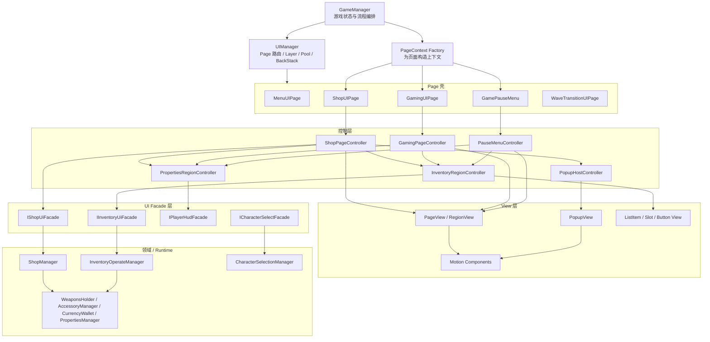
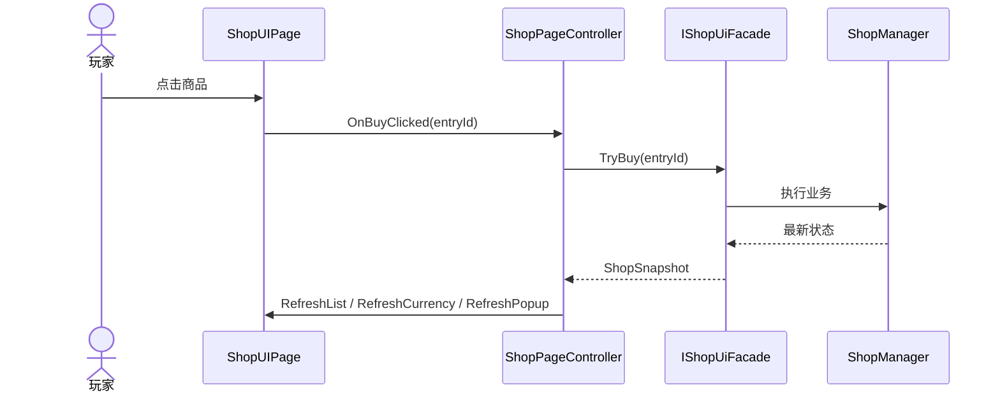

# UI 架构重构计划

## 1. 背景

当前项目的 UI 已经具备一套可工作的 Page 级基础设施：

- `Assets/Scripts/UI/Core/Runtime/UIManager.cs`
  - 负责 Page 打开、关闭、替换、层级、池化与返回栈
- `Assets/Scripts/UI/Core/Runtime/UIPageBase.cs`
  - 负责页面生命周期和页面级过场承接
- `Assets/Scripts/Managers/GameManager.cs`
  - 负责游戏状态切换，并驱动 `UIManager` 打开对应页面

这些能力本身没有明显方向性问题，属于可保留资产。

当前真正混乱的部分主要集中在 **Page 内部管理**：

- 一个复杂 Page 往往同时负责
  - 业务事件订阅
  - 运行时对象查找
  - 局部状态维护
  - 子面板开关
  - 动画触发
  - 列表实例化
  - 弹窗管理
- 许多仅在页面内部生效的交互，也被提升成了 `GameEventBus` 全局事件
- 多个 Page 存在重复的“属性栏 / 背包栏 / 局部弹窗 / 列表项点击”模式，但没有统一抽象

当前最典型的问题集中在以下文件：

- `Assets/Scripts/UI/Instances/ShopUIPage.cs`
- `Assets/Scripts/UI/Instances/GamingUIPage.cs`
- `Assets/Scripts/UI/Instances/GamePauseMenu.cs`
- `Assets/Scripts/UI/Instances/Child/InventoryUI.cs`
- `Assets/Scripts/UI/Instances/CharacterSelect/CharacterSelectUIPage.cs`

本计划的目标不是推倒当前 UI 系统，而是在保留 Page 路由层的前提下，补齐 Page 内部的控制与编排结构。

---

## 2. 当前问题拆解

### 2.1 Page 内缺少统一编排者

当前复杂页面通常由 `UIPageBase` 子类本体直接承担全部页内逻辑，导致 Page 本体逐渐膨胀。

后果：

- Page 很快变成“大而全脚本”
- 子区域之间相互影响时，修改点分散
- 新增一个面板或局部弹窗会持续抬高复杂度

### 2.2 局部交互被错误地提升成全局事件

例如：

- 列表项点击
- 页内弹窗开关
- 页内按钮点击
- 区域显隐切换

这类交互本质上属于“同一 Page 内部协作”，但当前很多都通过 `GameEventBus` 传递。

后果：

- 调试链路长
- UI 脚本之间的真实依赖关系不直观
- 页面内部状态难以集中管理

### 2.3 依赖建立方式过于隐式

多个 Page 在打开后主动 `FindFirstObjectByType` 或 `GetComponent` 来寻找运行时对象。

后果：

- Page 的依赖边界不清晰
- 场景结构变化时容易出错
- 后续很难做 UI 侧测试或局部替换

### 2.4 Page 与页内 Panel / Popup 的边界不清晰

当前存在两类混用：

- 真正的 Page，由 `UIManager` 管理
- Page 内部的 sidebar / popup / child panel，也在用近似 Page 的方式管理

后果：

- 页内会逐渐演化出“第二套隐式页面系统”
- 生命周期与收尾逻辑变得混乱

### 2.5 页内状态分散

当前局部状态往往散落在多个脚本字段中，例如：

- 当前选中项
- 当前是否打开某个 sidebar
- 当前是否显示某类 popup
- 当前点击项 index

后果：

- 状态切换难以追踪
- 列表刷新后，选中态与弹窗态容易失效

### 2.6 列表与弹窗仍依赖临时 index 身份

当前 Inventory / Shop 等区域大量依赖“当前列表索引”传递上下文。

后果：

- 一旦刷新、插入、删除或重排，身份就不稳定
- 后续做复杂交互时会越来越脆弱

---

## 3. 重构目标

### 3.1 第一目标：保留现有 Page 路由层

本次重构不推翻以下能力：

- `UIManager` 的 Page 路由
- `UIPageBase` 的生命周期壳
- `UISequenceDirector / UISidebarRevealMotion` 等动画组件
- `GameManager -> UIManager` 的游戏状态驱动方式

### 3.2 第二目标：补齐 Page 内控制层

让复杂 Page 不再直接承担所有职责，而是拆分为：

- Page 壳
- Page Controller
- Region Controller
- Dumb View

### 3.3 第三目标：重新约束 UI 通信规则

明确区分：

- 什么属于全局事件
- 什么属于 Page 内直接回调
- 什么属于 UI 到业务的 facade 调用

### 3.4 第四目标：为后续逐步推进提供稳定计划文档

该文档将作为后续推进基线，后续实现时按阶段更新状态，而不是每次重新从头设计。

---

## 4. 非目标

本计划当前不包含以下事项：

- 不整体迁移到 UI Toolkit
- 不引入重型 MVVM 框架
- 不推翻现有 UGUI 资源与 Prefab 组织
- 不一次性重构所有页面
- 不为了抽象而强行给每个简单页面增加额外层级

---

## 5. 目标架构

### 5.1 总体架构图



### 5.2 交互流示意



### 5.3 分层职责

#### `UIManager`

只负责：

- Page 打开 / 关闭 / 替换
- Layer 挂载
- Pooling
- BackStack
- 页面级激活态
- 页面级转场

不负责：

- 某个 Page 里有哪些 sidebar
- 页内局部 popup 如何联动
- 页内列表如何选中

#### `UIPageBase`

只作为 Page 生命周期壳，负责：

- `OnPageOpened`
- `OnPageClosed`
- 页面级进出场

不再承载复杂页内编排。

#### `PageController`

每个复杂页面一个，负责：

- 维护 PageState
- 绑定 / 解绑 View 回调
- 订阅 facade 数据
- 协调多个 Region
- 决定区域显隐、刷新与弹窗行为

#### `RegionController`

用于复杂 Page 内部区域，负责：

- 单一区域的局部状态
- 局部交互流程
- 区域内 View 刷新

例如：

- 背包区
- 属性区
- 商店列表区
- Popup Host

#### `View`

只负责：

- 显示数据
- 暴露按钮或条目点击回调
- 播放动画
- 维护 Inspector 引用

不负责：

- 找运行时对象
- 发全局业务事件
- 执行业务逻辑

#### `UiFacade`

负责给 UI 提供稳定接口，屏蔽底层实现细节。

在过渡期内，facade 内部允许继续适配：

- 现有 Manager
- 现有 Runtime Component
- 必要的事件总线桥接

---

## 6. 通信规则

### 6.1 继续使用 `GameEventBus` 的场景

- 跨系统广播
- 游戏状态变化
- 波次推进
- 暂停 / 恢复
- GameOver / StageComplete / Shop 这类跨 Page 流程事件

### 6.2 不再默认使用 `GameEventBus` 的场景

- 同一 Page 内部的按钮点击
- 同一 Page 内部的条目点击
- 局部 popup 开关
- sidebar 显示 / 隐藏
- 页内选中项切换

这些改为：

- View 回调给 Controller
- Controller 决定状态变化
- Controller 调用 View 更新

### 6.3 依赖建立规则

- Page 打开时通过 `payload/context` 传入显式依赖
- View 不主动 `FindFirstObjectByType`
- Controller 不直接依赖场景结构
- UI 到业务统一走 facade

### 6.4 动画规则

- 动画逻辑保留在 View 层
- Controller 只表达“显示/隐藏/切换哪个区域”
- 动画组件保持复用，不重写基础 motion 框架

### 6.5 身份规则

- 列表项不再长期依赖临时 index
- 引入稳定 `entryId` 或 runtime handle
- Controller 内部负责从稳定身份映射到视图选中态

---

## 7. 模块规划

### 7.1 建议保留的现有模块

- `Assets/Scripts/UI/Core/Data/`
- `Assets/Scripts/UI/Core/Runtime/`
- `Assets/Scripts/UI/Core/Runtime/Navigation/`
- `Assets/Scripts/UI/Core/Runtime/UIMotion/`

### 7.2 建议新增的模块

- `Assets/Scripts/UI/Contracts/Contexts/`
- `Assets/Scripts/UI/Contracts/Facades/`
- `Assets/Scripts/UI/Contracts/Snapshots/`
- `Assets/Scripts/UI/Pages/`
- `Assets/Scripts/UI/Regions/`
- `Assets/Scripts/UI/Widgets/`

### 7.3 目标目录建议

```text
Assets/Scripts/UI
├─ Core
│  ├─ Data
│  ├─ Runtime
│  └─ Navigation
├─ Contracts
│  ├─ Contexts
│  ├─ Facades
│  └─ Snapshots
├─ Pages
│  ├─ Menu
│  ├─ Shop
│  ├─ Gaming
│  ├─ Pause
│  ├─ WaveTransition
│  └─ CharacterSelect
├─ Regions
│  ├─ Inventory
│  ├─ Properties
│  ├─ ShopList
│  ├─ Tooltip
│  └─ PopupHost
├─ Widgets
│  ├─ Inventory
│  ├─ Shop
│  ├─ Character
│  └─ Common
└─ Motion
```

---

## 8. 当前文件到目标角色的映射

### 8.1 直接保留

- `Assets/Scripts/UI/Core/Runtime/UIManager.cs`
- `Assets/Scripts/UI/Core/Runtime/UIPageBase.cs`
- `Assets/Scripts/UI/Core/Runtime/UIRuntimeState.cs`
- `Assets/Scripts/UI/Core/Runtime/UIClickTarget.cs`
- 现有 motion 组件

### 8.2 需要拆分的复杂页面

#### `ShopUIPage`

目标拆分为：

- `ShopUIPage`：页面壳
- `ShopPageController`
- `ShopPageView`
- `ShopPageContext`
- `ShopListRegionController/View`
- `InventoryRegionController/View`
- `PropertiesRegionController/View`

#### `GamingUIPage`

目标拆分为：

- `GamingUIPage`
- `GamingPageController`
- `GamingHudRegion`
- `InventoryRegion`
- `PropertiesRegion`
- `TooltipRegion`
- `BuffBarRegion`

#### `GamePauseMenu`

目标拆分为：

- `GamePauseMenu`
- `PauseMenuController`
- `PauseMenuView`
- 通用 `InventoryRegion`
- 通用 `PropertiesRegion`

#### `InventoryUI`

目标从 Child 脚本升级为真正的 Region：

- `InventoryRegionView`
- `InventoryRegionController`
- `InventoryRegionState`
- `PopupHostView`
- `PopupHostController`

### 8.3 轻量处理即可的页面

以下页面可以保留轻量写法，仅按需要补最小控制层：

- `MenuUIPage`
- `GameOverUIPage`
- `StageCompleteUIPage`
- `CharacterSelectUIPage`
- `WaveTransitionUIPage`

---

## 9. 分阶段实施计划

### Phase 0：统一术语与边界

目标：

- 明确 `Page / Region / Popup / Widget` 四类概念
- 明确只有真正的 Page 交给 `UIManager`
- 明确页内交互默认不走全局事件

交付物：

- 本计划文档
- 团队约定的 UI 分层共识

验收标准：

- 后续新建 UI 时，能先判断它属于 Page、Region、Popup 还是 Widget

### Phase 1：补合同层与上下文层

目标：

- 为重构提供最小合同层，不直接动大面积 UI Prefab

当前进展：

- 已新增 `IPageController`
- 已新增 `GamingPageContext / PauseMenuContext / ShopPageContext`
- 已新增 `UIPageContextFactory`
- 已新增 `IShopUiFacade` 与基于事件总线的过渡实现
- 已新增 `IInventoryUiFacade / IPlayerHudFacade` 合同占位
- `UIPageOpenContext` 已支持泛型 `GetPayload<T>()`
- `ShopUIPage` 已具备 “Page 壳 + controller 装配点” 的最小入口
- `ShopUIPage` 的 sidebar 局部状态已开始进入 controller
- `GamingUIPage / GamePauseMenu` 已开始消费显式 page context

新增建议：

- `IPageController`
- `ShopPageContext`
- `GamingPageContext`
- `PauseMenuContext`
- `IShopUiFacade`
- `IInventoryUiFacade`
- `IPlayerHudFacade`

验收标准：

- 新页面或改造页面可以通过 `payload/context` 获取依赖
- UI 不再被迫在页面打开后自行搜索运行时对象

### Phase 2：以 Shop 页面为第一块样板

目标：

- 用 `ShopUIPage` 建立第一套可复制样板

实施重点：

- 将 `ShopUIPage` 从“大脚本”拆成 Page 壳 + Controller + Regions
- 将 `ShopItemContainer` 改为纯 View 回调
- 将商店列表、属性栏、背包栏的联动统一收束到 `ShopPageController`

当前进展：

- `ShopPageController` 已接管 reroll / continue / sidebar / item 命令入口，以及 snapshot / currency 的页面刷新调度
- `ShopItemContainer` 已改为纯 View 回调，不再直接发布购买或锁定的全局业务事件
- `ShopUIPage` 已开始把商店列表渲染与按钮绑定收束到轻量 `ShopListRegionView`，作为后续 region 拆分样板
- `ShopUIPage` 已开始把属性栏与背包栏的表现层职责收束到 `ShopPropertiesRegionView / ShopInventoryRegionView`
- 已新增 `ShopSidebarRegionHost`，将 Shop 页内双 sidebar region 的构造、绑定、解绑、toggle 事件转发与统一收尾收束为页面级宿主

验收标准：

- `ShopUIPage` 本体显著瘦身
- 页内交互不再依赖全局事件串联
- reroll、购买、货币刷新、sidebar 联动都由 controller 统一调度

### Phase 3：重构 Inventory 区域

目标：

- 解决当前 UI 内最痛的页内弹窗与条目管理问题

当前进展：

- `InventoryUI` 已开始从 Child 脚本向更明确的 `InventoryListRegionView / InventoryPopupHostView` 边界收束
- `InventoryRegionController / InventoryRegionState / IInventoryUiFacade` 过渡链路已落地，`InventoryUI` 已切到显式控制流
- `InventoryItem` 与活跃中的 `WeaponOperatePopup` 已改为纯 View 回调，列表点击与 sell / merge 不再由 UI 直接发布全局业务事件
- 当前仍保留 `EventBusInventoryUiFacade -> InventoryOperateManager` 的事件桥接，作为后续 facade 下沉前的过渡
- Inventory 活跃链路已从临时 `itemIndex` 切向稳定 `entryId`，快照、条目点击、弹窗打开、sell / merge 与关闭回路已开始统一身份语义
- `InventoryRegionState` 已开始集中维护当前快照、选中项与弹窗项，列表刷新后可按稳定 `entryId` 自动关闭失效弹窗并恢复仍有效的弹窗内容
- `InventoryOperateManager` 已开始暴露直接事件与命令入口，`ManagerInventoryUiFacade` 已落地，`InventoryUI` 现支持“外部注入 facade / 直连 manager / 事件桥回退”的渐进接入顺序
- `GamingPageContext / PauseMenuContext` 已开始显式持有 `InventoryFacade`，`GamingUIPage / GamePauseMenu` 已能在页面打开时把 facade 装配给 `InventoryUI`
- `EventBusInventoryUiFacade` 已改为 manager-first 的兼容 facade：优先直连 `InventoryOperateManager`，仅在无法解析 manager 时才回退 `GameEventBus`
- `RequestInventorySnapshotEvent / InventorySnapshotChangedEvent / RequestInventoryItemOperatePanelEvent / InventoryItemOperatePanelDataEvent / InventoryItemSellClickedEvent / InventoryItemMergeClickedEvent / InventoryItemOperatePanelShouldCloseEvent` 这类纯 UI 过渡事件已从 Inventory 主链中移除
- `InventoryUIItemSnapshot / InventoryItemOperateResource` 已迁到 `Assets/Scripts/UI/Contracts/Snapshots/`，旧 `InventoryEvents.cs` 已删除，Inventory 数据合同不再挂在旧事件目录或 UI 容器文件中

实施重点：

- 将 `InventoryUI` 收束为 `InventoryRegionView`
- 新增 `InventoryRegionController`
- 引入 `InventoryRegionState`
- 统一武器 / 饰品 popup 的宿主与关闭逻辑
- 逐步移除 Inventory 内部局部事件链

验收标准：

- 点击物品后的弹窗行为不再依赖多段全局事件往返
- 当前选中态、弹窗态由统一状态对象维护
- 条目身份不再长期依赖临时 index

### Phase 4：统一 Gaming 与 Pause 的公共 Region

目标：

- 把重复的区域逻辑沉淀成共用 Region

当前进展：

- 已新增 `IInventoryFacadeContext`，让 `GamingPageContext / PauseMenuContext / ShopPageContext` 以统一合同暴露 `InventoryFacade`
- 已新增 `InventoryUiHostBinding`，将 `InventoryUI` 的查找、facade 注入与关闭释放收束为公共装配入口
- `GamingUIPage / GamePauseMenu / ShopUIPage` 已切到共享的 Inventory 宿主装配路径，页面本体不再各自维护一套 `CacheInventoryUI / ConfigureInventoryRegion / ReleaseConfiguredFacade` 重复逻辑
- 已新增 `PageContextBinding`，将 `UIPageOpenContext` payload 解析、fallback context 创建与关闭时 `Dispose + null` 收束为统一页面上下文生命周期入口
- 已新增 `SidebarRegionMotion`，将 `UISidebarRevealMotion` 的 show/hide、默认态刷新、关闭收尾与时序配置收束为公共 sidebar motion 宿主
- 已新增 `SidebarRegionMotionGroup`，将多块 sidebar 的联合 show/hide、立即隐藏、时序配置与 close-wait 收尾收束为页面级 sidebar 生命周期宿主
- `GamePauseMenu / ShopPropertiesRegionView / ShopInventoryRegionView` 已开始共享同一套 sidebar motion 封装，减少页面与 region 各自重复持有 `UISidebarRevealMotion` 细节
- `GamePauseMenu` 已开始使用 `SidebarRegionMotionGroup` 接管双 sidebar 的统一生命周期管理，页面本体不再手写成对的 tween 收尾与显隐遍历
- `SidebarRegionMotionGroup` 已补齐“追加 close-wait 回调但不覆盖底层 tween 原有收尾逻辑”的保护，避免 group 宿主接管后吞掉 `UISidebarRevealMotion / UIRevealMotion` 自身的完成态处理
- 已新增 `SidebarToggleRegionView`，将 toggle 按钮点击、音效触发与侧栏显隐收束为更明确的共用 region view
- `ShopPropertiesRegionView / ShopInventoryRegionView` 已开始共享同一套 sidebar toggle 宿主，`ShopPropertiesRegionView` 现只保留属性描述绑定职责
- `ShopUIPage` 已确认值得补页面级 sidebar 宿主，现已通过 `ShopSidebarRegionHost` 收束双 sidebar region 的页面装配与生命周期释放
- 已新增 `PropertiesDescriberBinding`，将 `PropertiesManager -> Describer` 的订阅、解绑与刷新收束为独立绑定件
- `ShopPropertiesRegionView` 已进一步瘦身为 “sidebar toggle 宿主 + properties describer binding” 的组合壳
- 已确认当前 UI 中直接消费 `PropertiesManager -> Describer` 展示链路的页面仍只有 `ShopUIPage`；`PropertiesDescriberBinding` 已补齐解绑清空行为，后续暂不继续沿这条线扩展抽象
- 已新增 `GamingHudRegionHost`，将 `GamingUIPage` 的 HUD 事件订阅、角色状态绑定、货币/波次刷新、tooltip 收尾与打开时的快照请求收束为页面级 HUD 生命周期宿主
- 已新增 `GamingInputRegionHost`，将 `GamingUIPage` 的 joystick 查找、逐帧输入发布与关闭归零收束为页面级输入生命周期宿主

实施重点：

- 抽出通用 `InventoryRegion`
- 抽出通用 `PropertiesRegion`
- 抽出必要的 `PopupHost` 或 `TooltipRegion`

验收标准：

- `GamingUIPage` 与 `GamePauseMenu` 不再各写一套相似逻辑
- 复用边界清晰

### Phase 5：整理 CharacterSelect 与 WaveTransition

目标：

- 统一架构风格，但不为简单页面过度设计

实施重点：

- `CharacterSelectUIPage` 改为轻量 controller 驱动
- `WaveTransitionUIPage` 拆分为升级区 / 宝箱区两个 region

验收标准：

- 架构风格统一
- 简单页面仍然保持轻量

### Phase 6：收尾与规范化

目标：

- 将临时桥接方案逐步收尾

实施重点：

- 清理过量的 UI 层 `GameEventBus` 依赖
- 清理 `FindFirstObjectByType`
- 视情况补充 UI 开发规范或测试基线

验收标准：

- UI 层职责边界稳定
- 新功能接入不再显著增加系统混乱度

---

## 10. 推荐推进顺序

后续按以下顺序推进：

1. 先完成 Phase 1 的合同层与上下文层
2. 先拿 `ShopUIPage` 建立第一套样板
3. 再处理 `InventoryUI` 这块当前最痛的区域
4. 再把 `GamingUIPage / GamePauseMenu` 的公共区域统一起来
5. 最后统一收尾与清理旧事件链

原因：

- `ShopUIPage` 复杂但边界清晰，适合作为第一块样板
- `InventoryUI` 虽然最痛，但直接下手风险略高，先有样板再改会更稳
- 公共 Region 的抽象应该建立在至少一到两个成功样板之上

---

## 11. 风险与控制策略

### 11.1 风险：一次性改动过大

控制策略：

- 坚持按 Phase 渐进推进
- 一次只重构一个页面或一个区域

### 11.2 风险：Facade 过厚

控制策略：

- facade 只提供 UI 直接需要的数据与命令
- 不把 facade 做成第二个业务层

### 11.3 风险：新旧模式长期并存

控制策略：

- 每推进一个 Phase，就明确替换一块旧路径
- 不长期保留双轨交互链

### 11.4 风险：继续使用 index 作为稳定身份

控制策略：

- 在 Inventory / Shop 等区域逐步引入稳定 `entryId`
- 先在 controller 层完成身份映射，再下沉到 facade

---

## 12. 后续推进规则

后续根据本计划推进时，遵循以下规则：

- 每次只推进一个明确子目标
- 每次推进前，先回看本计划对应 Phase
- 每次推进后，更新本文件中的推进看板
- 如发现原计划不适配当前代码现状，优先补充“计划修订说明”，不要默默偏离

---

## 13. 推进看板

| Phase | 名称 | 状态 | 备注 |
| --- | --- | --- | --- |
| Phase 0 | 统一术语与边界 | Completed | 本计划文档已落地 |
| Phase 1 | 合同层与上下文层 | Completed | Context / Facade / payload 入口已落地，HUD/Inventory facade 具体实现留待后续阶段 |
| Phase 2 | Shop 页面样板 | In Progress | Shop controller 已接管命令入口，ShopList / Properties / Inventory 边界已开始从 page 本体中抽离 |
| Phase 3 | Inventory 区域重构 | In Progress | InventoryUI 已接入 controller/facade 过渡层，List / PopupHost 边界已抽出，活跃链路已切到稳定 entryId，刷新后的弹窗态恢复、manager-backed facade、Gaming/Pause/Shop 显式装配点、manager-first 兼容 facade、纯 UI 过渡事件清理与 Contracts/Snapshots 迁移已接入，页面宿主链路已开始避免沿用已释放 facade 的隐式重启，InventoryUI 自回退也已优先直连 manager |
| Phase 4 | Gaming / Pause 公共 Region | In Progress | `IInventoryFacadeContext`、`InventoryUiHostBinding`、`PageContextBinding`、`SidebarRegionMotion`、`SidebarRegionMotionGroup`、`SidebarToggleRegionView`、`ShopSidebarRegionHost`、`GamingHudRegionHost` 与 `PropertiesDescriberBinding` 已落地，Inventory 宿主、page context 生命周期、sidebar motion、sidebar group、Shop sidebar 页面宿主、Gaming HUD 生命周期宿主、toggle region 与 properties describer 公共装配已开始从 Gaming/Pause/Shop 页面本体与局部 region 中抽离 |
| Phase 5 | CharacterSelect / WaveTransition 整理 | Pending | 未开始 |
| Phase 6 | 收尾与规范化 | Pending | 未开始 |

---

## 14. 当前建议的下一步

下一步建议开始进入：

- `Phase 4：统一 Gaming 与 Pause 的公共 Region`

最小切入建议：

- 在当前共享的 `InventoryUiHostBinding` 基础上，继续判断 `GamingUIPage / GamePauseMenu` 中还有哪些 Inventory 相关逻辑可以下沉为更明确的共用 Region 宿主
- 在 `PageContextBinding` 已统一 payload 解析与关闭释放后，继续观察 `GamingUIPage / GamePauseMenu / ShopUIPage` 中还有哪些页面级生命周期逻辑值得继续收束为更明确的宿主辅助能力
- 该判断已完成：`ShopUIPage` 值得补页面级 sidebar 宿主，现已通过 `ShopSidebarRegionHost` 收束双 sidebar region 的页面装配、toggle 转发与生命周期释放
- 在 `SidebarRegionMotion` 已落地后，开始梳理 `PropertiesRegion` 的公共装配边界，优先处理 `GamePauseMenu / ShopUIPage` 中重复的 sidebar 生命周期与属性区域依赖接线
- 在 `SidebarToggleRegionView` 已接管 Shop 的 toggle + sidebar 行为后，继续判断 `PropertiesRegion` 的数据绑定是否值得再抽成更通用的 describer / manager 绑定件
- `PropertiesDescriberBinding` 已落地后，下一步优先判断 Pause / 后续页面是否也会消费 `PropertiesManager` 描述展示；若不会，则到此为止，避免继续空抽象
- 该判断已完成：当前先停止继续扩展 `PropertiesDescriberBinding` 这条抽象线，把后续重点转回 `GamingUIPage / GamePauseMenu` 的 Inventory 宿主与 sidebar 生命周期共用能力
- `GamingUIPage` 已开始通过 `GamingHudRegionHost` 收束 HUD 事件订阅、角色状态绑定与打开/关闭生命周期，下一步优先判断 `moveJoystick` 输入发布是否值得继续下沉为更明确的输入宿主
- 该判断已完成：`GamingUIPage` 的 joystick 输入已通过 `GamingInputRegionHost` 收束，page 本体进一步回到“上下文装配 + HUD 宿主 + Inventory 宿主”的薄壳形态
- 保持 `Phase 3` 已落地的 `InventoryRegionController / InventoryRegionState` 稳定，不在未确认收益前重新打散已有边界
- 若后续继续抽公共 Region，优先做“页面宿主装配 + 生命周期释放”这一层，再决定是否需要继续下沉到更完整的 Region Host 或 Controller 复用

这样可以在不推翻当前 Inventory 重构成果的前提下，开始把真正重复的页面宿主逻辑逐步沉到公共 Region 层。
